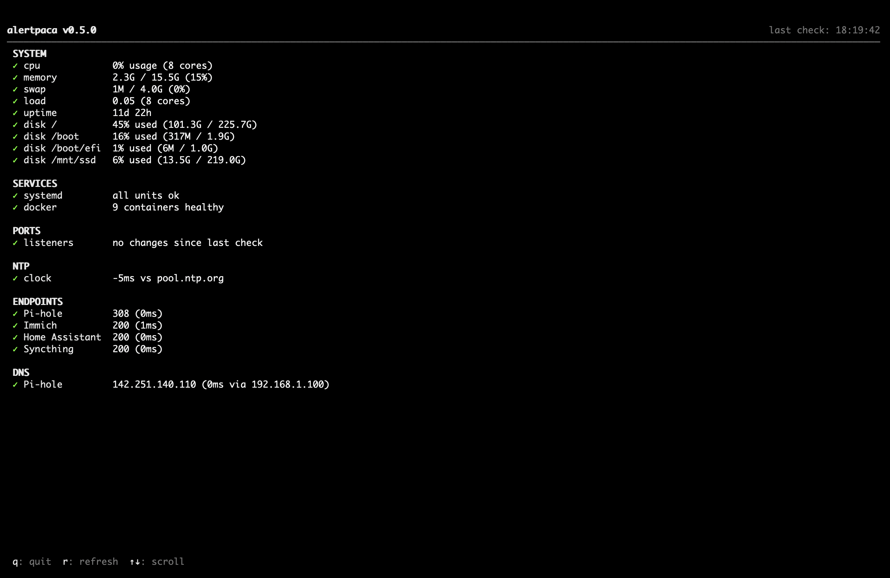

<p align="center">
  
</p>

# alertpaca

[](https://www.rust-lang.org/)
[](LICENSE)
[](https://ratatui.rs/)

**Server health checker** — run it, see what needs attention.

Single binary, zero config, one screen.

## Why alertpaca?

alertpaca doesn't show you what's happening — it tells you what's about to go wrong.

It predicts when disks will fill up, checks if backups actually ran, notices when services silently disappear, and warns before TLS certificates expire. One screen, no graphs, no config required.

<p align="center">
  
</p>

## Quick start

```bash
# Build from source
cargo build --release

# Run — zero config needed
./target/release/alertpaca
```

Press `q` to quit, `r` to refresh, `↑↓` to scroll.

## CLI modes

### Interactive TUI (default)

```sh
alertpaca [-c path/to/config.toml]
```

Full-screen terminal UI with auto-refresh (60s), keyboard navigation, and a splash screen on startup.

| Key | Action |
|-----|--------|
| `q` | Quit |
| `r` | Force immediate refresh |
| `↑` / `k` | Scroll up |
| `↓` / `j` | Scroll down |

### JSON output (`--json`)

```sh
alertpaca --json
```

Runs all checks once, prints a JSON array to stdout, and exits. Suitable for piping to `jq`, scripts, or AI agents.

```json
[
  {
    "section": "System",
    "name": "cpu",
    "status": "Ok",
    "summary": "12% usage (4 cores)"
  },
  {
    "section": "Certificates",
    "name": "nextcloud.home.lan:443",
    "status": "Warning",
    "summary": "expires in 21d"
  }
]
```

### Plain-text table (`--once`)

```sh
alertpaca --once
```

Runs all checks once, prints a human-readable table to stdout, and exits.

### MCP server (`--mcp`)

```sh
alertpaca --mcp
```

Runs an [MCP](https://modelcontextprotocol.io) (Model Context Protocol) server on stdio, exposing a `check_health` tool. This allows AI agents (e.g. Claude Desktop, Claude Code) to check server health programmatically.

**Tool:** `check_health`
- **Parameters:** none
- **Returns:** JSON array of check results (same schema as `--json` output)

**Claude Desktop configuration:**

```json
{
  "mcpServers": {
    "alertpaca": {
      "command": "/path/to/alertpaca",
      "args": ["--mcp"]
    }
  }
}
```

### Exit codes

Exit codes apply to `--json` and `--once` modes:

| Code | Meaning |
|------|---------|
| 0 | All checks passed (Ok or Skipped) |
| 1 | Error (config load failure, I/O error) |
| 2 | At least one check returned Warning or Critical |

## What it checks

| Check | Auto-detected | Status |
|-------|:---:|--------|
| CPU usage | ✓ | warn >80%, critical >95% |
| Memory usage | ✓ | warn >80%, critical >95% |
| Disk usage | ✓ | warn >80%, critical >90% |
| Disk fill prediction | ✓ | estimates days until full |
| System load | ✓ | warn > cores, critical > 2x cores |
| Uptime | ✓ | informational |
| Systemd failed units | ✓ | critical if any failed |
| Docker containers | ✓ | warn if unhealthy/restarting |
| Backup freshness | config | warn at max_age, critical at 2x |
| TLS certificate expiry | config | warn <30d, critical <7d |
| Port/service drift | ✓ | warn if listeners disappear |

## Configuration

Optional. Create `~/.config/alertpaca/config.toml`:

```toml
[[backup]]
name = "documents"
type = "file"
path = "/mnt/backup/docs"
pattern = "backup-*.tar.gz"
max_age = "24h"

[[backup]]
name = "photos"
type = "restic"
repo = "/mnt/backup/restic-photos"
max_age = "7d"
# password_file = "/etc/restic/password"

[[backup]]
name = "tank/data"
type = "zfs"
dataset = "tank/data"
max_age = "1h"

[[certificate]]
endpoint = "nextcloud.home.lan:443"

[[certificate]]
endpoint = "jellyfin.home.lan:443"
```

## State files

Stored in `~/.local/share/alertpaca/`:

- `history.json` — disk usage history for fill prediction
- `ports.json` — last known listening ports for drift detection

## License

MIT
